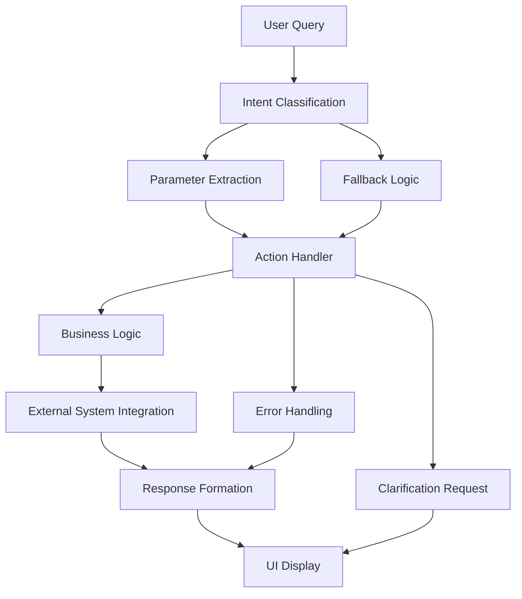

# Architecture Patterns Documentation

## Overview
This document captures the proven architectural patterns from the stock checker implementation that should be replicated for all future business flows in the 2-BIZ Stock Checker system.

## Complete Flow Architecture

### 1. User Query → AI Classification → Action Execution → UI Display



## Pattern Analysis: Stock Checker Implementation

### Flow Breakdown: "check stock for RANY"

1. **API Entry Point** (`/api/ai/route.ts`)
   - Receives user message via POST request
   - Validates input and API key configuration
   - Routes to intent classifier
   - Handles clarification flow with conversation context

2. **Intent Classification** (`intentClassifier.ts`)
   - GPT-4 analyzes the query with sophisticated prompt engineering
   - Extracts entities (styleNumber, styleName, color, size, etc.)
   - Returns structured intent with confidence score
   - Fallback logic using `searchMapper.ts` if AI fails
   - Supports season code detection (`.ea25`, `.es24`, etc.)

3. **Action Routing** (`actionHandlers.ts`)
   - `executeAction()` routes to appropriate handler via switch statement
   - `handleStockCheck()` processes the stock checking request
   - Comprehensive error handling and logging throughout

4. **Parameter Processing** (`searchMapper.ts`)
   - Converts AI entities to system parameters
   - Determines query type (style number vs name) using `detectQueryType()`
   - Detects row type (Stock/Available/PO Available) from context
   - Applies filters (zero filter) and validation
   - Supports multi-type queries with `extractMultipleSearchParams()`

5. **External Integration** (`openStylePage.ts`)
   - Scrapes live data from SPY system using Playwright
   - Handles authentication and session management
   - Returns HTML for parsing with robust error handling

6. **Data Processing** (`parseStock.ts`)
   - Parses HTML into structured data using Cheerio
   - Handles multiple data formats and row types
   - Validates and normalizes results

7. **UI Presentation** (`DataDisplay.tsx` + `StockDataTable.tsx`)
   - Displays stock data in organized, interactive tables
   - Supports multi-type display (Stock + Available + PO Available)
   - Includes sorting, filtering, and collapsible sections
   - Responsive design with proper loading states

## Proven Architectural Patterns

### 1. Intent Classification Pattern

**File**: `src/lib/ai/intentClassifier.ts`

**Key Components**:
```typescript
interface Intent {
  type: 'stock_check' | 'sales_order' | 'b2b_login' | 'inventory_update' | 'report_generate'
  confidence: number
  entities: {
    styleNumber?: string
    styleName?: string
    color?: string
    size?: string
    customer?: string
    country?: string
    quantity?: number
    [key: string]: any
  }
  action: string
  parameters: Record<string, any>
  analysis?: {
    reasoning: string
    context: string
  }
}
```

**Pattern Benefits**:
- Sophisticated prompt engineering with detailed examples
- Entity extraction with business context awareness
- Fallback logic for AI failures
- Season code detection for fashion industry
- Conversation history support for multi-turn interactions

**Replication Strategy**:
- Add new intent types to the main switch statement
- Extend entity extraction with business-specific fields
- Update the OpenAI prompt with new examples
- Maintain the same confidence scoring and fallback patterns

### 2. Action Handler Pattern

**File**: `src/lib/ai/actionHandlers.ts`

**Key Components**:
```typescript
export interface ActionResponse {
  success: boolean
  message: string
  data?: any
  requiresClarification?: boolean
  clarificationQuestions?: string[]
  suggestions?: string[]
  feedbackId?: string
  error?: string
}

export async function handleStockCheck(params: StockCheckParams, originalQuery?: string): Promise<ActionResponse>
```

**Pattern Benefits**:
- Consistent response structure across all actions
- Comprehensive parameter validation with clarification requests
- Multi-step conversation support
- Detailed logging with emoji indicators
- Performance tracking and feedback recording
- Graceful error handling with user-friendly messages

**Replication Strategy**:
1. Create new action handler following the same signature pattern
2. Implement parameter validation with specific clarification questions
3. Add comprehensive logging at each step
4. Record attempts with feedback system
5. Return consistent ActionResponse structure

### 3. Parameter Extraction Pattern

**File**: `src/lib/ai/searchMapper.ts`

**Key Components**:
```typescript
export function extractSearchParams(userQuery: string, entities: any): {
  searchQuery: string
  queryBy: 'no' | 'name'
  rowType: 'Stock' | 'Available' | 'PO Available'
  color?: string
  size?: string
  filterZeros?: boolean
}
```

**Pattern Benefits**:
- Smart query type detection (style number vs name)
- Context-aware row type determination
- Multi-type query support
- Zero filter intelligence
- Season code pattern recognition

**Replication Strategy**:
- Create specialized extraction functions for each business flow
- Maintain the same logging and validation patterns
- Support multi-parameter extraction where needed
- Include business-specific context detection

### 4. External System Integration Pattern

**File**: `src/lib/openStylePage.ts`

**Key Components**:
- Playwright browser automation for web scraping
- Authentication and session management
- Robust error handling and retry logic
- Environment-based configuration

**Pattern Benefits**:
- Headless browser automation for complex interactions
- Session persistence across requests
- Network error recovery
- Configurable timeouts and retry mechanisms

**Replication Strategy**:
- Use the same Playwright patterns for new system integrations
- Maintain consistent credential management
- Implement similar error handling and logging
- Follow the same async/await patterns

### 5. Data Processing Pattern

**File**: `src/lib/parseStock.ts`

**Key Components**:
- Cheerio-based HTML parsing
- Data normalization and validation
- Multiple format support
- Type-safe data extraction

**Pattern Benefits**:
- Robust HTML parsing with error handling
- Consistent data structure output
- Validation of extracted data
- Type safety throughout the process

### 6. UI Component Pattern

**Files**: `src/components/DataDisplay.tsx`, `src/components/StockDataTable.tsx`

**Key Components**:
```typescript
interface DataDisplayProps {
  data: any
  message: string
}

export default function DataDisplay({ data, message }: DataDisplayProps)
```

**Pattern Benefits**:
- Type guards for different data types
- Responsive and accessible design
- Interactive features (sorting, filtering, collapsing)
- Consistent styling with Tailwind CSS
- Loading states and error feedback

**Replication Strategy**:
- Create new display components following the same prop patterns
- Use type guards to handle different data types
- Maintain consistent styling and interaction patterns
- Include proper loading and error states

## Template for New Business Flows

### Step 1: Extend Intent Classification
1. Add new intent type to `Intent` interface
2. Update OpenAI prompt with examples
3. Add entity extraction logic
4. Test with various query variations

### Step 2: Create Action Handler
```typescript
export async function handleNewFlow(params: NewFlowParams, originalQuery?: string): Promise<ActionResponse> {
  const startTime = Date.now()
  let feedbackId: string | undefined
  
  console.log('🎯 New Flow Handler Starting...')
  console.log('📋 Input Parameters:', JSON.stringify(params, null, 2))
  console.log('💬 Original Query:', originalQuery)
  
  try {
    // 1. Validate required parameters
    // 2. Process business logic
    // 3. Integrate with external systems
    // 4. Return structured response
  } catch (error) {
    // Error handling with feedback recording
  }
}
```

### Step 3: Add Parameter Extraction
```typescript
export function extractNewFlowParams(userQuery: string, entities: any): NewFlowParams {
  // Extract and validate parameters
  // Apply business logic
  // Return structured parameters
}
```

### Step 4: Create UI Components
```typescript
interface NewFlowDisplayProps {
  data: NewFlowData
  message: string
}

export function NewFlowDisplay({ data, message }: NewFlowDisplayProps) {
  // Type guards for data validation
  // Responsive UI components
  // Interactive features
}
```

### Step 5: Update Main Router
```typescript
// In executeAction function
case 'new_flow':
  return await handleNewFlow(intent.entities, originalQuery)
```

## Success Criteria for New Flows

### Technical Requirements
- [ ] Intent classification accuracy > 90%
- [ ] Comprehensive parameter validation
- [ ] Multi-step conversation support
- [ ] Robust error handling and recovery
- [ ] Performance tracking and feedback
- [ ] Type safety throughout the flow
- [ ] Responsive UI with loading states

### User Experience Requirements
- [ ] Clear clarification questions when information is missing
- [ ] Helpful error messages with suggestions
- [ ] Consistent visual design and interactions
- [ ] Fast response times (< 2 seconds for most operations)
- [ ] Graceful handling of edge cases

### Business Requirements
- [ ] Integration with existing SPY system
- [ ] Audit trail for all operations
- [ ] Multi-tenant support preparation
- [ ] Scalable architecture for high volume

## Next Steps

Based on this analysis, your current system already has excellent foundations. For **Phase 1: Sales Order Creation Enhancement**, I recommend:

1. **Enhance the existing `handleSalesOrder`** - It's already functional but could be expanded
2. **Improve parameter extraction** - Add more sophisticated customer lookup
3. **Create dedicated UI components** - For sales order display and interaction
4. **Add comprehensive testing** - Following the established patterns

Your architecture is solid and ready for expansion. The proven patterns from the stock checker provide an excellent template for rapid feature development. 